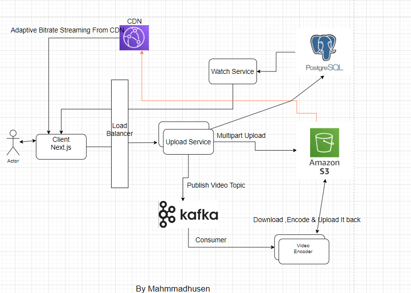

# High-Level Design Implementation of a YouTube-Like System
## Demo Video Link : https://youtu.be/Uw6VuYLr2C8
## About the Project, Services, and Key Learnings

### About:
This project involves the high-level implementation of a system similar to YouTube. The following use cases have been implemented:
- **Upload Service**
- **Watch Service**
- **Transcode Service:**
- **Client (Next.js):**

Video watching is facilitated through adaptive bit rate streaming with HTTP Live Streaming (HLS). AWS S3 is used to store video data, and PostgreSQL is used for storing video metadata. Kafka is utilized to handle the video transcoding process. OAuth2 integration with Google login has also been implemented.

### Components:

1. **Client (Next.js):**
   - Frontend that displays content.
   - Performs HLS streaming from the S3 master M3U8 file.
   - Uses NextAuth for Google login.
   - Divides uploaded video into small chunks and sends them to the upload service.

2. **Upload Service:**
   - Uploads video chunks to S3 using multipart upload.
   - Stores video metadata in PostgreSQL.
   - Publishes Kafka messages indicating that the video should be transcoded.

3. **Transcode Service:**
   - Consumes messages from Kafka.
   - Downloads videos from S3, encodes them into different formats, uploads them back to S3, and deletes the local data.

4. **Watch Service:**
   - Lists all videos with their metadata, duration, and S3 links for the Next.js client to use.

###  Deployment Diagram:

